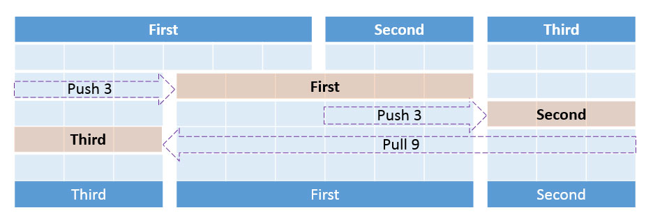

#Push Pull: Source Ordering

Using these source ordering classes, you can shift columns around between our breakpoints.

##Moving the last column to first position
1. Open index.html for editing
2. Locate the *benefits* section, and number each element in the *row* with a comment `<!-- First -->`

        

            

				<!-- First -->
                @Html.Ipsum.h3().p().h4().p().h4().p()
            

            

				<!-- Second -->
                @Html.Ipsum.h3().p()
                

                    <a href="#" class="button">Primary Action</a>
                

            

        

3. Add a *third* element with the following properties
	- Full with for small devices
	- Full width for medium devices
	- 3 units width for large devices
	- label the element `<!-- Third -->`
	- Add an `<h4>` tag with the text `Twitter Feed`
	- Add a `<ul>` with 4 list items that have 10 words, and are links

	        

	            

					<!-- First -->
	                @Html.Ipsum.h3().p().h4().p().h4().p()
	            

	            

					<!-- Second -->
	                @Html.Ipsum.h3().p()
	                

	                    <a href="#" class="button">Primary Action</a>
	                

	            

	            

	                <!-- Third -->
	                <h4>Twitter Feed</h4>
	                @Html.Ipsum.ul(4,10,true)
	            

	        

4. Update the large layout to accommodate the new element so that the layout measures **[First] 6,[Second] 3,[Third] 3** _totaling 12 units_ 
	- Change the first element to large-6
	- Change the second element to large-3

	        

	            

					<!-- First -->
	                @Html.Ipsum.h3().p().h4().p().h4().p()
	            

	            

					<!-- Second -->
	                @Html.Ipsum.h3().p()
	                

	                    <a href="#" class="button">Primary Action</a>
	                

	            

	            

	                <!-- Third -->
	                <h4>Twitter Feed</h4>
	                @Html.Ipsum.ul(4,10,true)
	            

	        

5. Open index.html in the browser and resize the browser, observe how the page is rendered at different sizes.
6. Using push and pull classes rearrange elements so that the third element in the source markup is rendered first on large devices. |Third|First|Second|

	- Add the class `large-push-3` to the first element	
	- Add the class `large-push-3` to the second element
	- Add the class `large-pull-9` to the third element

	        

	            

	                <!-- First -->
	                @Html.Ipsum.h3().p().h4().p().h4().p()
	            

	            

	                <!-- Second -->
	                @Html.Ipsum.h3().p()
	                

	                    <a href="#" class="button">Primary Action</a>
	                

	            

	            

	                <!-- Third -->
	                <h4>Twitter Feed</h4>
	                @Html.Ipsum.ul(4,10,true)
	            

	        

7. Open index.html in the browser and resize the browser, observe how the page is rendered at different sizes.